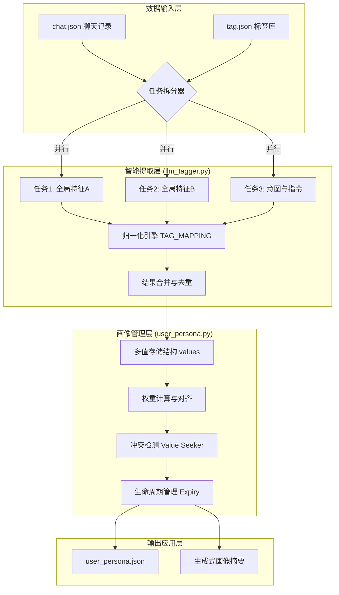

# 用户画像系统技术架构白皮书 (V10 专家版)

## 1. 系统概述
本系统旨在从**非结构化聊天记录**中，通过大语言模型 (LLM) 结合工业级启发式逻辑，自动化地构建、更新并管理**立体化用户画像**。系统能够精准捕捉用户的长短期意图、消费性格及即时指令，为下游推荐引擎提供决策支持。

---

## 2. 总体架构图 (Architecture)



---

## 3. 分层架构详解

### 3.1 智能提取层 (Intelligence Extraction Layer)
这是系统的“大脑”，负责将混乱的文本转化为结构化标签。

#### 核心代码：[llm_tagger.py](file:///d:/Code/heima/tuijianxiton/llm_tagger.py)
```python
async def extract_user_tags_async(chat_history: str, tag_library: List[Dict]):
    # 1. 任务拆分 (Map)
    tasks = [_call_llm(chunk) for chunk in chunks]
    # 2. 并行执行
    results = await asyncio.gather(*tasks)
    # 3. 归一化与合并 (Reduce)
    for res in results:
        tag, _ = normalize_tag_data(tag)
        merged.append(tag)
```

*   **原理**：采用 **Map-Reduce** 思想。通过并行调用 LLM，降低了单次请求的 Token 压力和处理延迟。
*   **原因**：串行调用在面对长文本时极慢（>200s），且 LLM 在单次请求中处理过多标签库时容易产生“注意力丧失”。
*   **作用**：将非结构化文本高效、准确地转化为符合 [prompt.py](file:///d:/Code/heima/tuijianxiton/prompt.py) 约束的结构化 JSON。

---

### 3.2 逻辑清洗与归一化层 (Normalization Layer)
负责处理 AI 的“幻觉”和表达多样性。

#### 核心代码：[llm_tagger.py: TAG_MAPPING](file:///d:/Code/heima/tuijianxiton/llm_tagger.py)
```python
TAG_MAPPING = {
    "risk_averse": "decision_style", 
    "price_concern": "price_sensitivity",
    "baby_cry_detection": "哭声检测"
}
```

*   **原理**：通过**静态映射表**对 LLM 的输出进行强制对齐。
*   **原因**：LLM 可能会输出 `risk_aversion` 或 `risk_averse` 等变体，这会导致数据库中出现维度冗余，稀释特征权重。
*   **作用**：确保画像维度的**高度收敛**，解决中英混杂、近义词重复问题。

---

### 3.3 画像管理层 (Persona Management Layer)
这是系统的“心脏”，负责维护用户特质的长期演进。

#### 核心代码：[user_persona.py](file:///d:/Code/heima/tuijianxiton/user_persona.py)
```python
class UserPersonaSystem:
    def __init__(self):
        self.global_traits = {} # 多值存储
        self.ALPHA_GLOBAL = 0.005 # 衰减系数
        
    def _detect_conflicts(self):
        # 既要又要识别逻辑
        if price_high and quality_high:
            add_tag("value_seeker")
```

*   **原理**：
    1.  **多值存储**：使用列表而非单值，记录用户特质的多个侧面。
    2.  **权重对齐**：通过 `Tier` 和 `Type` 复合评分，让不同来源的标签具有可比性。
    3.  **冲突识别**：通过衍生标签捕捉用户的深层心理矛盾。
*   **原因**：真实用户是复杂的，单一标签无法刻画“既要高品质又要低价格”的典型电商用户。
*   **作用**：实现用户特质的**立体化刻画**和**动态演进**。

---

### 3.4 生命周期与时效层 (Lifecycle Layer)
确保画像“不过期”，实时反映用户现状。

#### 核心代码：[user_persona.py: update_persona](file:///d:/Code/heima/tuijianxiton/user_persona.py)
```python
# 分层过期策略
if tag_type == "instruction":
    expiry = now + 3600 # 1小时
elif tag_type == "intent":
    expiry = now + 86400 * 30 # 30天
```

*   **原理**：基于标签类型设置不同的**指数衰减系数**和**硬性过期时间**。
*   **原因**：用户的购买意图（想买手机）是短暂的，而性格特质（风险厌恶）是长期的。不加区分会导致画像“脏数据”堆积。
*   **作用**：保证画像的**时效性**，自动清理已完成或已失效的购买意图。

---

### 3.5 交互与展示层 (Interaction Layer)
将复杂的 JSON 转化为可理解的业务洞察。

#### 核心代码：[user_persona.py: _generate_summary](file:///d:/Code/heima/tuijianxiton/user_persona.py)
*   **原理**：基于权重最高的核心特质，采用结构化模版生成自然语言摘要。
*   **作用**：为运营人员提供秒级的用户概览，无需阅读复杂的 JSON。

---

## 4. 总结
本架构通过 **“并行提取 -> 语义归一 -> 多值建模 -> 动态衰减”** 的完整链路，构建了一个既快又准的工业级画像系统。它不仅能看懂用户“说了什么”，更能推断出用户“是个什么样的人”，为精准推荐奠定了数据基础。
