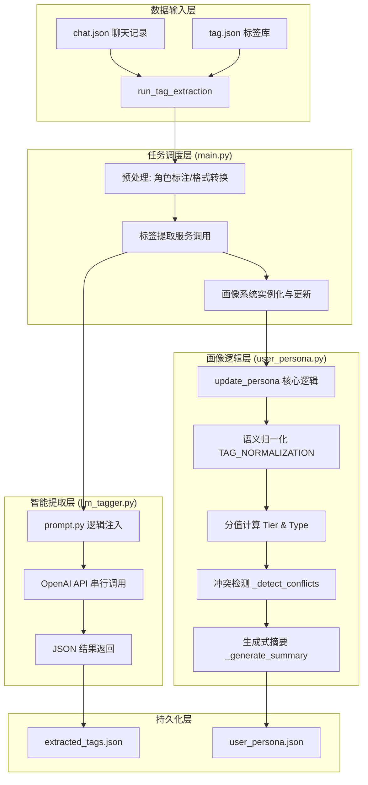

# 用户画像系统源码级技术白皮书 (V8 专家版)

## 1. 系统概述
本系统旨在通过大语言模型 (LLM) 从**非结构化聊天记录**中提取高度结构化的用户标签，并结合时间衰减、权重计算及冲突检测机制，构建并维护一个动态演进的**立体化用户画像**。

---

## 2. 总体架构图 (Source-based Architecture)



---

## 3. 架构分层源码级解析

### 3.1 任务调度层 (Orchestration)
负责整个生命周期的串联，包括数据加载、缓存检查及多模块协作。

#### 核心代码分析：[main.py](file:///d:/Code/heima/tuijianxiton/main.py)
*   **角色标注逻辑** (L30-L33)：
    ```python
    role_label = "用户" if msg['role'] == 'user' else "客服"
    chat_lines.append(f"{role_label}: {msg['content']}")
    ```
    *   **原理**：将原始 JSON 格式转化为带有明确说话者的自然语言对话，为 LLM 提供必要的上下文语境。
*   **缓存机制** (L46-L50)：优先读取本地 `extracted_tags.json`，减少不必要的 API 调用成本。

---

### 3.2 智能提取层 (Intelligence Extraction)
利用 LLM 的语义理解能力完成“非结构化 -> 结构化”的飞跃。

#### 核心代码分析：[llm_tagger.py](file:///d:/Code/heima/tuijianxiton/llm_tagger.py)
*   **逻辑注入** (L25)：
    ```python
    system_prompt = AI_TAG_PROMPT.format(TAG_LIST=tag_list_str)
    ```
    *   **原理**：通过 [prompt.py](file:///d:/Code/heima/tuijianxiton/prompt.py) 注入**反向检查**、**主体检测**等 5 大核心约束铁律，确保 LLM 输出的准确性。
*   **强 JSON 约束** (L35)：
    ```python
    response_format={"type": "json_object"}
    ```
    *   **原理**：利用大模型的原生 JSON 模式，确保返回数据可被 Python 直接解析。

---

### 3.3 画像逻辑层 (Logic Management)
系统的“心脏”，处理数据归一化、权重演进及深层心理推断。

#### 核心代码分析：[user_persona.py](file:///d:/Code/heima/tuijianxiton/user_persona.py)
*   **语义归一化** (L29-L35)：
    ```python
    self.TAG_NORMALIZATION = {
        "保守主义": "low_risk_tolerance",
        "风险厌恶": "low_risk_tolerance",
        # ...
    }
    ```
    *   **原理**：在画像层而非提取层进行映射，确保即使 LLM 表达多样，画像维度也能高度收敛。
*   **复合权重对齐** (L43-L51)：
    ```python
    def _get_base_score(self, tier, tag_type):
        tier_score = self.TIER_MAP.get(tier, 0.4)
        type_weight = self.TYPE_WEIGHT.get(tag_type, 1.0)
        return tier_score * type_weight * 2.0
    ```
    *   **作用**：统一了 `Global Traits` 和 `Intents` 的分值体系，解决了跨模块权重不可比的问题。
*   **冲突检测 (Value Seeker)** (L150-L189)：
    *   **原理**：自动扫描 `price_sensitivity` 和 `quality_requirement`。若两者同时高分，则推断出用户为“极致性价比追求者”，体现了系统的深度建模能力。

---

### 3.4 生命周期与应用层 (Lifecycle & Output)
管理数据的时效性，并输出业务洞察。

#### 核心代码分析：[user_persona.py: get_final_persona](file:///d:/Code/heima/tuijianxiton/user_persona.py)
*   **时效管理** (L195)：通过 `expiry` 时间戳对指令和意图进行动态清理。
*   **生成式摘要** (L204-L226)：基于模板和权重最高标签生成自然语言侧写，为运营提供“一秒读懂用户”的能力。

---

## 4. 核心原理总结
1.  **铁律驱动提取**：通过 Prompt 铁律防止客服参数污染画像。
2.  **多值并存架构**：解决单值覆盖问题，支持立体的多维度特征记录。
3.  **分层过期策略**：确保即时指令（1h）、短期意图（30d）和长期特质（永久）各司其职。
4.  **维度强制归一**：利用 `TAG_NORMALIZATION` 确保后端逻辑的健壮性。
