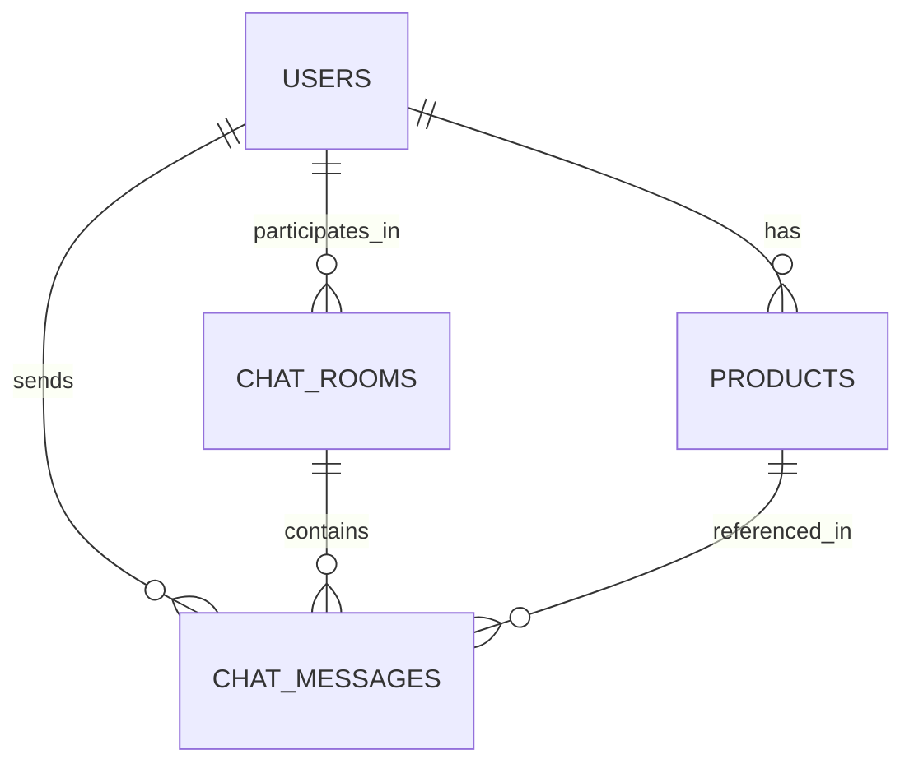

# 数据库 Schema 文档

## 1. 概述

本聊天系统使用 PostgreSQL 数据库，包含以下数据表：
- `users` - 用户表
- `products` - 商品表
- `chat_rooms` - 聊天室表
- `chat_messages` - 聊天消息表

## 2. 数据表结构

### 2.1 用户表 (`users`)

| 字段名 | 数据类型 | 约束 | 描述 |
| :--- | :--- | :--- | :--- |
| `id` | `SERIAL` | `PRIMARY KEY, INDEX` | 用户ID |
| `username` | `VARCHAR(50)` | `UNIQUE, NOT NULL, INDEX` | 用户名 |
| `password_hash` | `VARCHAR(255)` | `NOT NULL` | 密码哈希 |
| `role` | `VARCHAR(20)` | `NOT NULL` | 角色(customer/merchant) |
| `created_at` | `TIMESTAMP` | `DEFAULT CURRENT_TIMESTAMP` | 创建时间 |

### 2.2 商品表 (`products`)

| 字段名 | 数据类型 | 约束 | 描述 |
| :--- | :--- | :--- | :--- |
| `id` | `SERIAL` | `PRIMARY KEY, INDEX` | 商品ID |
| `name` | `VARCHAR(100)` | `NOT NULL` | 商品名称 |
| `description` | `TEXT` | `NOT NULL` | 商品描述 |
| `price` | `DECIMAL(10,2)` | `NOT NULL` | 商品价格 |
| `merchant_id` | `INTEGER` | `REFERENCES users(id)` | 商家ID |
| `created_at` | `TIMESTAMP` | `DEFAULT CURRENT_TIMESTAMP` | 创建时间 |

### 2.3 聊天室表 (`chat_rooms`)

| 字段名 | 数据类型 | 约束 | 描述 |
| :--- | :--- | :--- | :--- |
| `id` | `SERIAL` | `PRIMARY KEY, INDEX` | 聊天室ID |
| `customer_id` | `INTEGER` | `REFERENCES users(id), NOT NULL` | 客户ID |
| `merchant_id` | `INTEGER` | `REFERENCES users(id), NOT NULL` | 商家ID |
| `created_at` | `TIMESTAMP` | `DEFAULT CURRENT_TIMESTAMP` | 创建时间 |

### 2.4 聊天消息表 (`chat_messages`)

| 字段名 | 数据类型 | 约束 | 描述 |
| :--- | :--- | :--- | :--- |
| `id` | `SERIAL` | `PRIMARY KEY, INDEX` | 消息ID |
| `chat_room_id` | `INTEGER` | `REFERENCES chat_rooms(id), NOT NULL` | 聊天室ID |
| `sender_id` | `INTEGER` | `REFERENCES users(id), NOT NULL` | 发送者ID |
| `content` | `TEXT` | `NOT NULL` | 消息内容 |
| `message_type` | `VARCHAR(20)` | `NOT NULL` | 消息类型(text/product) |
| `product_id` | `INTEGER` | `REFERENCES products(id), NULL` | 商品ID(消息类型为product时使用) |
| `created_at` | `TIMESTAMP` | `DEFAULT CURRENT_TIMESTAMP` | 发送时间 |

## 3. 表关系

### 3.1 关系图



### 3.2 详细关系

- **用户与商品**：一个商家用户可以拥有多个商品（一对多关系）
- **用户与聊天室**：一个用户可以参与多个聊天室（一对多关系），每个聊天室包含一个客户和一个商家
- **用户与消息**：一个用户可以发送多个消息（一对多关系）
- **聊天室与消息**：一个聊天室可以包含多个消息（一对多关系）
- **商品与消息**：一个商品可以被引用在多个消息中（一对多关系），用于发送商品卡片

## 4. 索引

为了提高查询性能，以下字段创建了索引：

- `users.username` - 用于快速查找用户
- `users.id` - 主键索引，用于关联查询
- `products.id` - 主键索引，用于关联查询
- `chat_rooms.id` - 主键索引，用于关联查询
- `chat_messages.id` - 主键索引，用于关联查询
- `chat_messages.chat_room_id` - 用于快速查询聊天室的所有消息

## 5. 数据初始化

系统启动时会自动创建数据表结构，无需手动初始化。首次使用时，需要通过API注册用户账号。

## 6. 注意事项

1. **密码安全**：密码使用 bcrypt 算法加密存储，确保安全性
2. **数据一致性**：使用外键约束确保数据一致性
3. **性能优化**：合理使用索引提高查询性能
4. **备份策略**：建议定期备份数据库，防止数据丢失

## 7. 示例查询

### 7.1 获取用户的聊天室列表

```sql
-- 客户用户
SELECT * FROM chat_rooms WHERE customer_id = 1;

-- 商家用户
SELECT * FROM chat_rooms WHERE merchant_id = 2;
```

### 7.2 获取聊天室的消息

```sql
SELECT * FROM chat_messages 
WHERE chat_room_id = 1 
ORDER BY created_at ASC;
```

### 7.3 获取商家的商品列表

```sql
SELECT * FROM products WHERE merchant_id = 2;
```